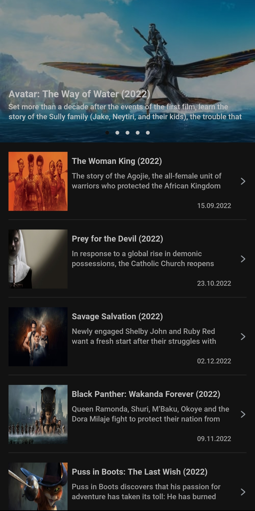
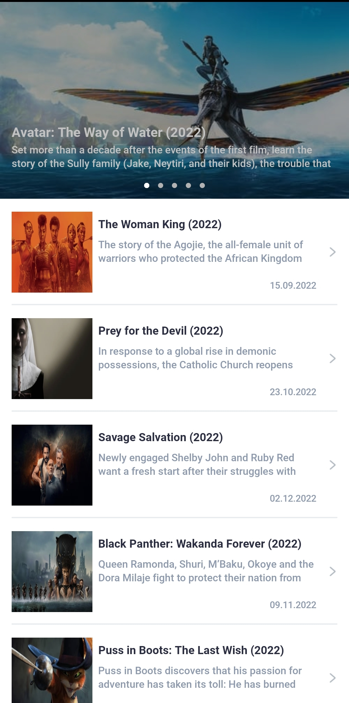
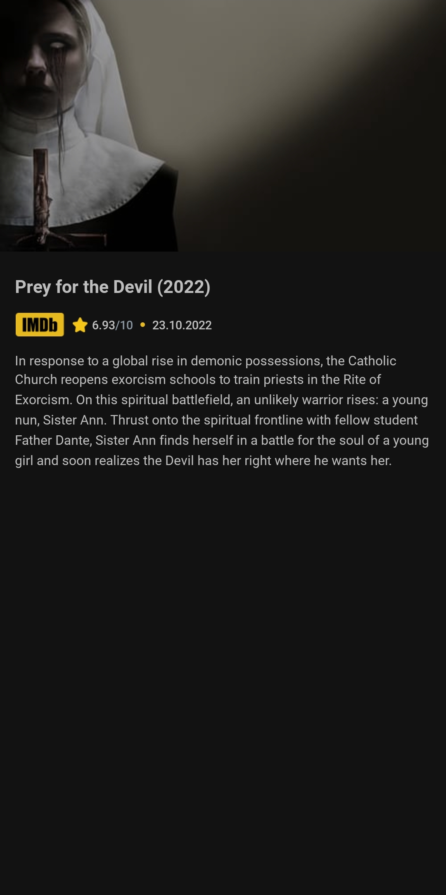
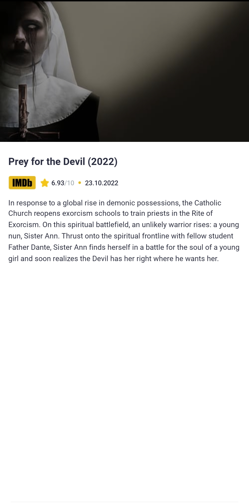
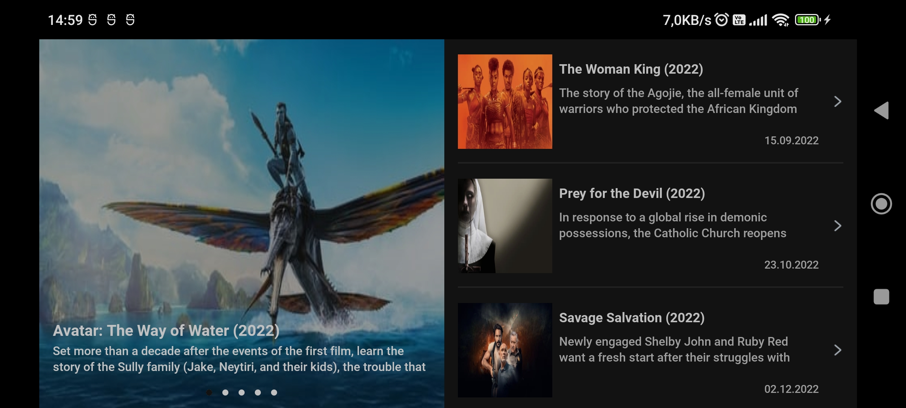

# MoviesApp

It's a demo project to display currently playing movies and track down the upcoming movies.

<br />

| Mode  | Movies (Dark) | Movies (Light) | Movie Details (Dark) | Movie Details (Light) |
|------|------|------|------|------|
| Portrait |  |  |  |  |

<br />

| Mode  | Movies (Dark) | Movie Details (Dark) |
|------|------------|------------|
| Landscape |  |  |

<br />

Aim is implementing new technologies and best practices in android development such as:
 - TDD
 - MVVM
 - HILT
 - Navigation Components
 - Coroutines
 - Flows
 - Retrofit
 - LiveData
 - ViewBinding
 - DataBinding
 - Pagination
 - Responsive Design
 - SafeArgs
 - Glide

<br />

### License
```
   Copyright (C) 2022 Mert Yazı
   Licensed under the Apache License, Version 2.0 (the "License");
   you may not use this file except in compliance with the License.
   You may obtain a copy of the License at

       http://www.apache.org/licenses/LICENSE-2.0

   Unless required by applicable law or agreed to in writing, software
   distributed under the License is distributed on an "AS IS" BASIS,
   WITHOUT WARRANTIES OR CONDITIONS OF ANY KIND, either express or implied.
   See the License for the specific language governing permissions and
   limitations under the License.
```
<br />

### Contributing
- Just make a pull request.
- Get an API key for your own from "https://www.themoviedb.org/"
- Paste that key to "gradle.properties" with keyword "API_KEY".
