# MoviesApp

It's a demo project to display currently playing movies and track down the upcoming movies. Users can add movies to favorites and can randomize them for easy choices.<br /><br />
Project is written in Kotlin.💯

<br />

| Mode  | Movies | Favorites | Details |
|------|------|------|------|
| Dark | 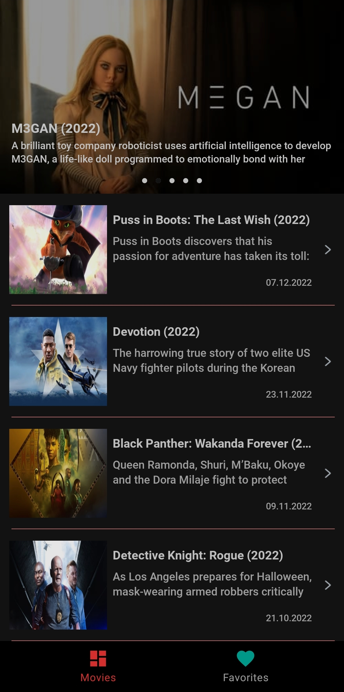 | 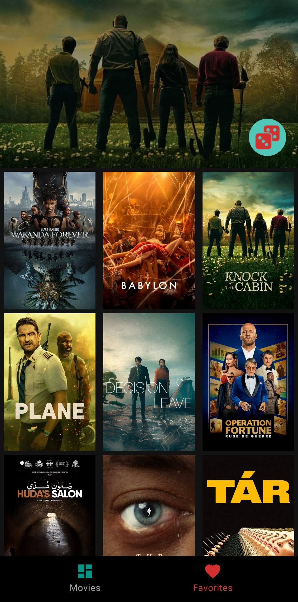 | 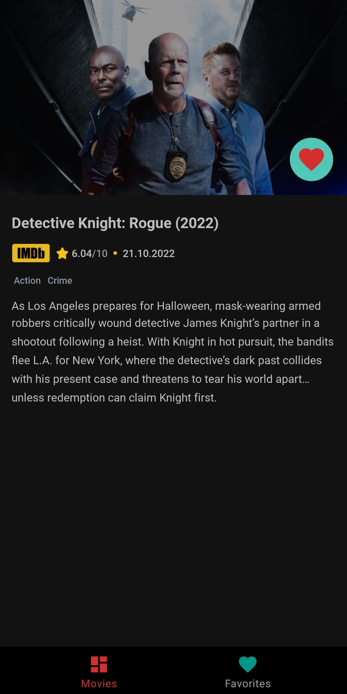 |
| Light | 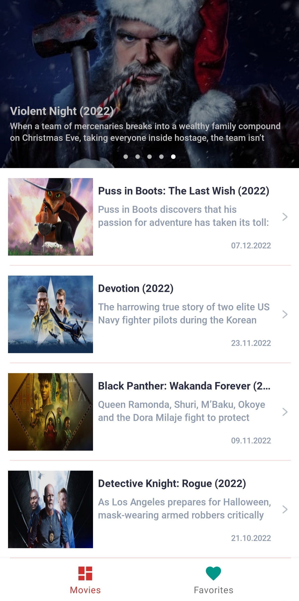 | 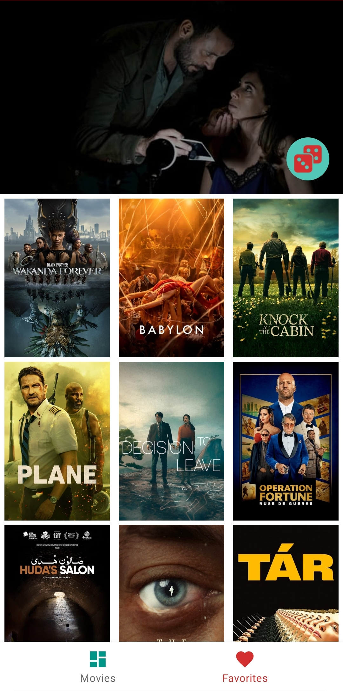 | 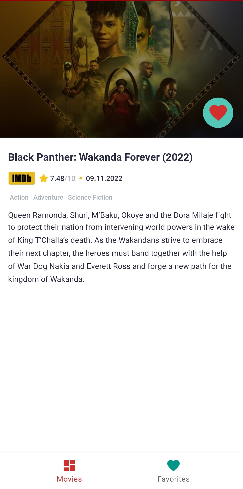 |

<br />

| Mode  | Movies | Favorites | Details |
|------|------|------|------|
| Dark | 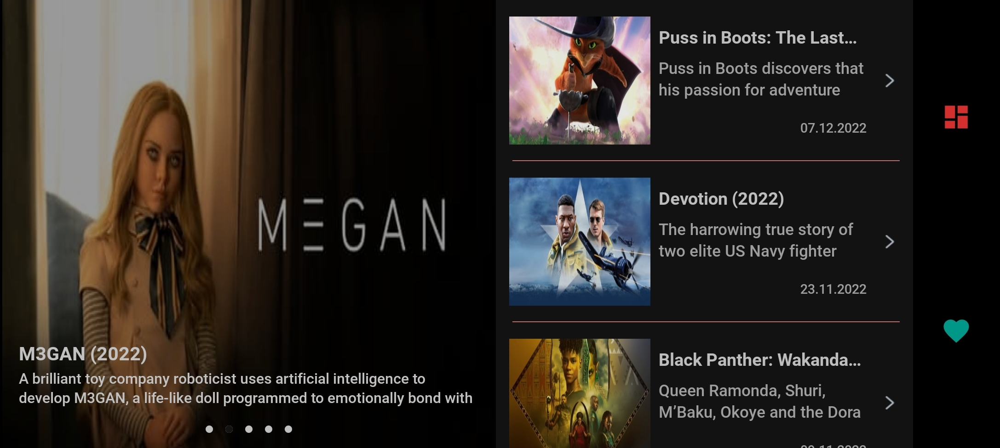 | 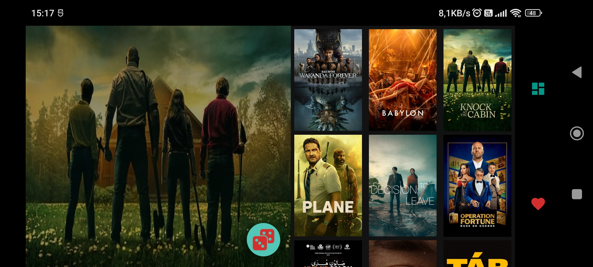 | 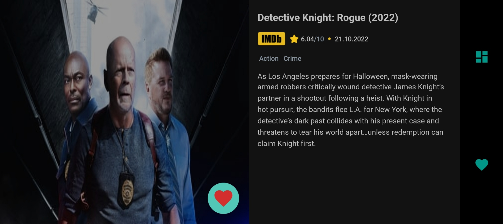 |
| Light | 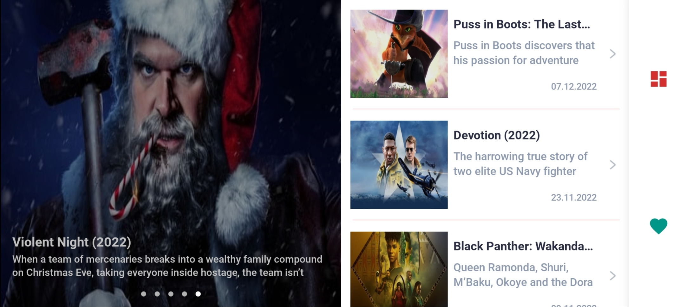 | 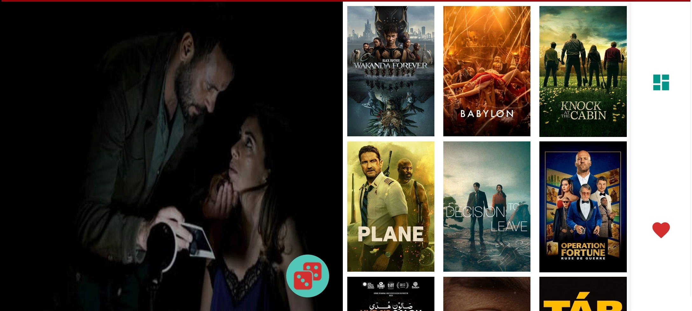 | 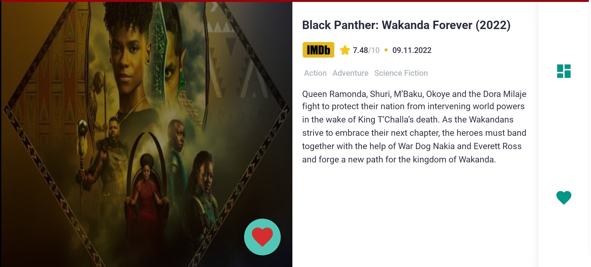 |

<br />

### The Aim Of The Project
Implementing new technologies and best practices in android development such as:
- [TDD](https://developer.android.com/training/testing/fundamentals) - Testing is an integral part of the app development process. By running tests against your app consistently, you can verify your app's correctness, functional behavior, and usability before you release it publicly.<br /><br />
- [Clean Architecture](https://medium.com/android-dev-hacks/detailed-guide-on-android-clean-architecture-9eab262a9011) - Clean architecture is a software design philosophy that separates the elements of a design into ring levels.<br /><br />
- [SOLID](https://medium.com/the-android-caf%C3%A9/solid-principles-the-kotlin-way-ff717c0d60da) - SOLID is a mnemonic acronym for five design principles intended to make software designs more understandable, flexible, and maintainable.<br /><br />
- [MVVM](https://developer.android.com/topic/libraries/architecture/viewmodel) - Its principal advantage is that it caches state and persists it through configuration changes.<br /><br />
- [HILT](https://dagger.dev/hilt) - Hilt provides a standard way to incorporate Dagger dependency injection into an Android application.<br /><br />
- [Navigation Components](https://developer.android.com/guide/navigation/navigation-getting-started) - Navigation component helps you implement navigation, from simple button clicks to more complex patterns, such as app bars and the navigation drawer.<br /><br />
- [Architecture Components](https://developer.android.com/topic/libraries/architecture) - It's a new collection of libraries that contains the lifecycle-aware components. It can solve problems with configuration changes, supports data persistence, reduces boilerplate code, helps to prevent memory leaks and simplifies async data loading into your UI.<br /><br />
- [Coroutines](https://kotlinlang.org/docs/reference/coroutines-overview.html) - In addition to opening the doors to asynchronous programming, coroutines also provide a wealth of other possibilities, such as concurrency and actors.<br /><br />
- [Retrofit](https://square.github.io/retrofit/) - A type-safe HTTP client for Android and Java. Retrofit turns your HTTP API into a Java interface.<br /><br />
- [Room](https://developer.android.com/training/data-storage/room) - The Room persistence library provides an abstraction layer over SQLite to allow fluent database access while harnessing the full power of SQLite.<br /><br />
- [LiveData](https://developer.android.com/topic/libraries/architecture/livedata) - LiveData is an observable data holder class. Unlike a regular observable, LiveData is lifecycle-aware, meaning it respects the lifecycle of other app components, such as activities, fragments, or services.<br /><br />
- [ViewBinding](https://developer.android.com/topic/libraries/view-binding) - View binding is a feature that allows you to more easily write code that interacts with views. Once view binding is enabled in a module, it generates a binding class for each XML layout file present in that module.<br /><br />
- [DataBinding](https://developer.android.com/topic/libraries/data-binding) - The Data Binding Library is a support library that allows you to bind UI components in your layouts to data sources in your app using a declarative format rather than programmatically.<br /><br />
- [Pagination](https://medium.com/@anitaa_1990/pagination-in-recyclerview-without-paging-library-1c48e9328f81) - Pagination helps you load and display small chunks of data at a time. Loading partial data on demand reduces usage of network bandwidth and system resources.<br /><br />
- [Sdp](https://github.com/intuit/sdp) - An android lib that provides a new size unit - sdp (scalable dp). This size unit scales with the screen size. It can help Android developers with supporting multiple screens.<br /><br />
- [Ssp](https://github.com/intuit/ssp) - An android lib that provides a new size unit - ssp (scalable sp). This size unit scales with the screen size based on the sp size unit (for texts). It can help Android developers with supporting multiple screens.<br /><br />
- [Glide](https://github.com/bumptech/glide) - Glide is a fast and efficient open source media management and image loading framework for Android that wraps media decoding, memory and disk caching, and resource pooling into a simple and easy to use interface.

<br />

### License
```
   Copyright (C) 2022 Mert Yazı
   Licensed under the Apache License, Version 2.0 (the "License");
   you may not use this file except in compliance with the License.
   You may obtain a copy of the License at

       http://www.apache.org/licenses/LICENSE-2.0

   Unless required by applicable law or agreed to in writing, software
   distributed under the License is distributed on an "AS IS" BASIS,
   WITHOUT WARRANTIES OR CONDITIONS OF ANY KIND, either express or implied.
   See the License for the specific language governing permissions and
   limitations under the License.
```
<br />

### Contributing
- Just make a pull request.
- Get an API key for your own from "https://www.themoviedb.org/"
- Paste that key to "gradle.properties" with keyword "API_KEY".
